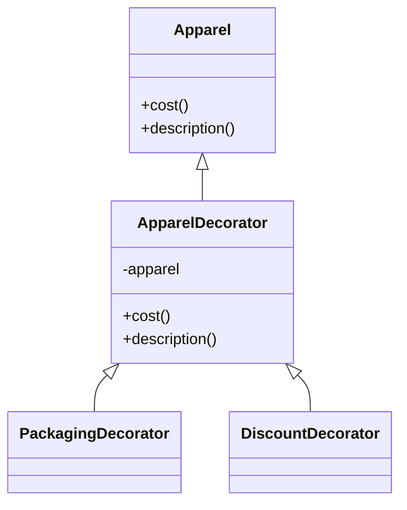

# МІНІСТЕРСТВО ОСВІТИ ТА НАУКИ

## Львівський національний університет ветеринарії і біотехнологій імені С.З.Ґжицького

# Звіт

**про виконання лаборатоної роботи №12**

**з дисципліни "Об'єктно-орієнтоване програмування"**

**на тему**

**Структурні шаблони проєктування**

Виконав: студент групи КН-31 Сасник Володимир

Перевірив: ст. викладач Назар Заплатинський

### Львів 2025

**Мета роботи - познайомитися з групою структурних шаблонів проєктування.**

## Хід роботи

### Структурні шаблони (Structural Design Patterns) — це патерни, які описують, як поєднувати класи та об’єкти у більші структури, зберігаючи їхню гнучкість і незалежність.

### Основна мета:

    - уникати дублювання коду;
    - приховувати складність реалізації;
    - підвищувати гнучкість — щоб можна було легко замінити одну частину іншою.

### Приклад реалізації на Java Script

```js
class Apparel {
  cost() {
    return 100;
  }

  description() {
    return "Basic Black T-Shirt";
  }
}

class ApparelDecorator {
  constructor(apparel) {
    this.apparel = apparel;
  }

  cost() {
    return this.apparel.cost();
  }

  description() {
    return this.apparel.description();
  }
}

class DiscountDecorator extends ApparelDecorator {
  constructor(apparel, percent) {
    super(apparel);
    this.percent = percent;
  }

  cost() {
    const basicCost = super.cost();
    return basicCost * (this.percent / 100);
  }
  description() {
    return super.description() + `, discount ${this.percent}%`;
  }
}

// Використання
let apparel = new Apparel();
console.log(apparel.cost(), apparel.description());

apparel = new PackagingDecorator(apparel);
console.log(apparel.cost(), apparel.description());

apparel = new DiscountDecorator(apparel, 20);
console.log(apparel.cost(), apparel.description());
```

#### UML-діяграма



### Запуск прикладу:

```bash
node structural-pattern.js
```

## Висновок:

### В ході виконання лабораторної роботи було реалізовано шаблон Decorator, який дозволяє динамічно додавати нову функціональність до об'єктів без зміни їх основної структури. Шаблон особливо корисний для розширення функціональності об'єктів у процесі виконання програми.
