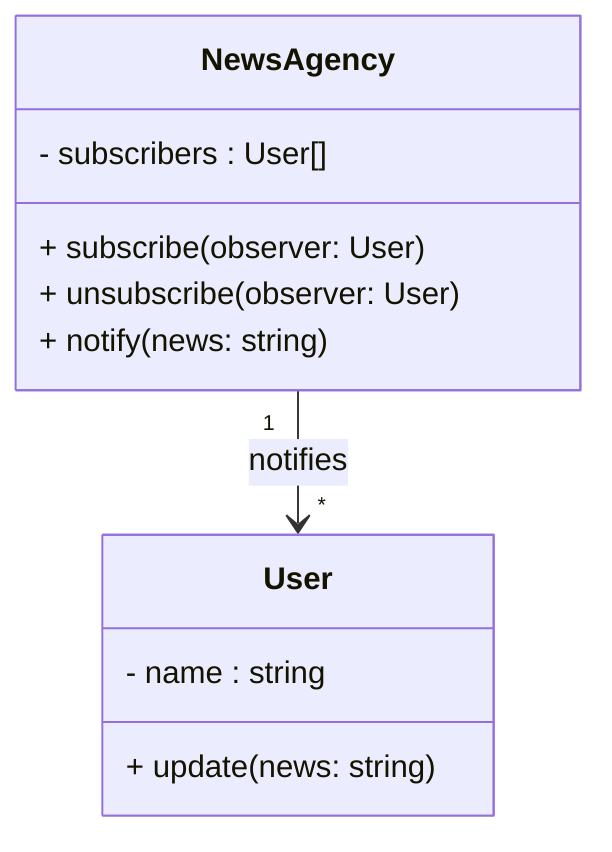

# МІНІСТЕРСТВО ОСВІТИ ТА НАУКИ

## Львівський національний університет ветеринарії і біотехнологій імені С.З.Ґжицького

# Звіт

**про виконання лаборатоної роботи №13**

**з дисципліни "Об'єктно-орієнтоване програмування"**

**на тему**

**Поведінкові шаблони проєктування**

Виконав: студент групи КН-31 Сасник Володимир

Перевірив: ст. викладач Назар Заплатинський

### Львів 2025

**Мета роботи - познайомитися з групою поведінкових шаблонів проєктування.**

## Хід роботи

### Поведінкові патерни — це шаблони, які описують як об’єкти взаємодіють між собою та реагують на події, тобто поведінку системи.

### Основна мета:

    - Впорядкувати комунікацію між об’єктами.
    - Розділити алгоритми та об’єкти, щоб змінювати поведінку без переписування класів.
    - Робити систему гнучкою та підтримуваною.

### Приклад реалізації на Java Script

```js
class NewAgancy {
  constructor() {
    this.subscribers = [];
  }

  subscribe(observer) {
    this.subscribers.push(observer);
  }

  unsubscribe(observer) {
    this.subscribers = this.subscribers.filter((sub) => sub !== observer);
  }

  notify(news) {
    this.subscribers.forEach((sub) => sub.update(news));
  }
}

class User {
  constructor(name) {
    this.name = name;
  }

  update(news) {
    console.log(`${this.name} отримав новину: "${news}"`);
  }
}

// Використання
const agency = new NewAgancy();

const user1 = new User("Іван");
const user2 = new User("Марія");
const user3 = new User("Олег");

agency.subscribe(user1);
agency.subscribe(user2);
agency.subscribe(user3);

agency.notify("Сьогодні знижки до 50%!");

// Виведе:
// Іван отримав новину: "Сьогодні знижки до 50%!"
// Марія отримав новину: "Сьогодні знижки до 50%!"
// Олег отримав новину: "Сьогодні знижки до 50%!"

agency.unsubscribe(user2);

agency.notify("Завтра нова колекція!");

// Іван отримав новину: "Завтра нова колекція!"
// Олег отримав новину: "Завтра нова колекція!"
```

#### UML-діяграма



### Запуск прикладу:

```bash
node behavior-pattern.js
```

## Висновок:

### У ході виконання лабораторної роботи було реалізовано шаблони Observer та Memento (знімок стану).Патерн Observer забезпечує слабке зв’язування між об’єктами та дозволяє автоматично сповіщати підписані об’єкти про зміни стану іншого об’єкта, що особливо корисно для побудови систем подій, сповіщень або оновлення інтерфейсів у реальному часі.Патерн Memento, у свою чергу, дає змогу зберігати та відновлювати попередні стани об’єкта без порушення інкапсуляції, що робить його зручним для реалізації функцій “Undo/Redo” або історії змін.Застосування цих шаблонів підвищує гнучкість, масштабованість і підтримуваність програмного коду.
